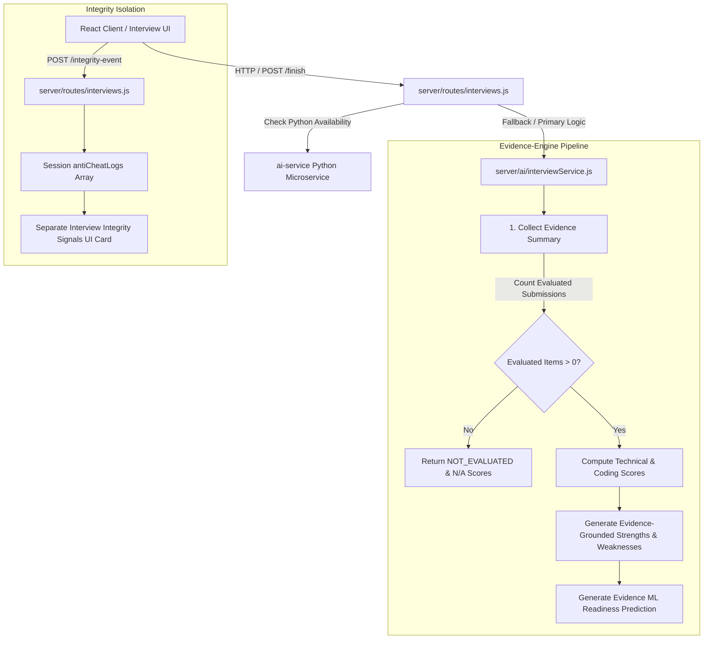

# CodeBuddy — Coding Interview Evidence-Based Evaluation Architecture & Hardening Report

## Executive Summary
The **CodeBuddy Coding Interview Evaluation Engine** has undergone a fundamental redesign and hardening pass to guarantee that candidate interview readiness scores, strengths, weaknesses, ML predictions, and feedback recommendations are strictly derived from **measurable attempt evidence and execution results**.

Prior implementation flaws allowed interview readiness scores (e.g., 84.5%) and communication sub-scores (e.g., 90) to be returned even when candidates made **zero question attempts** or **zero code submissions**. Furthermore, anti-cheat proctoring events penalized technical knowledge scores.

Under the new evidence-grounded architecture:
1. **Zero-Attempt Invariant**: Zero answered questions or coding attempts return `scoreStatus: "NOT_EVALUATED"`, `overallScore: null` (displayed as `N/A`), sub-scores as `null`, `strengths: ["Insufficient evidence"]`, `weaknesses: ["Insufficient evidence"]`, and `mlPrediction: "Not available yet"`.
2. **Coding-Only Evaluation Context**: Audio, filler words, speech patterns, and speaking rates are completely removed from Coding Interview evaluation. Sub-scores strictly consist of `Technical Knowledge` (40%), `Problem Solving` (30%), and `Coding Execution` (30%). The communication score is explicitly set to `"Not Applicable"`.
3. **Strict Separation of Integrity Signals**: Anti-cheat proctoring events (`tab_hidden`, `fullscreen_exit`, `window_blur`, `copy_paste`) are isolated in `antiCheatLogs` and `proctoring_report` and **NEVER** alter technical execution or problem-solving scores.
4. **Partial Evidence & Provisional Scoring**: A single coding attempt produces a `PROVISIONAL` evaluation status. Two or more attempts yield an `EVALUATED` status. Scores use a normalized weighted formula over valid evidence only.

---

## 1. System Architecture



---

## 2. Evaluation Rules & Mathematical Formulas

### 2.1 Evidence Summary Data Schema
Every interview session maintains an explicit `evidenceSummary` object:
```json
{
  "questionsPresented": 2,
  "questionsAttempted": 1,
  "questionsEvaluated": 1,
  "codingProblemsAttempted": 1,
  "codingSubmissions": 1,
  "acceptedSubmissions": 1
}
```

### 2.2 Score Formula & Weighting (Coding Interview)
Sub-scores are computed strictly from evaluated coding problem performance:
* **Coding Execution Score ($S_{\text{coding}}$)**:
  $$\text{Coding Score} = \text{round}\left( \frac{\text{Accepted Submissions}}{\text{Questions Evaluated}} \times 100 \right)$$

* **Problem Solving Score ($S_{\text{ps}}$)**:
  $$\text{Problem Solving Score} = \text{round}\left( \frac{\sum \text{Performance Scores}}{\text{Questions Evaluated}} \right)$$
  Where each problem performance score incorporates test case correctness, time efficiency, hints used, and problem difficulty.

* **Technical Knowledge Score ($S_{\text{tech}}$)**:
  $$\text{Technical Knowledge Score} = \text{round}(0.5 \times S_{\text{coding}} + 0.5 \times S_{\text{ps}})$$

* **Overall Technical Score ($S_{\text{overall}}$)**:
  $$S_{\text{overall}} = \text{round}(0.40 \times S_{\text{tech}} + 0.30 \times S_{\text{ps}} + 0.30 \times S_{\text{coding}})$$

* **Communication Score**:
  $$\text{Communication Score} = \text{"Not Applicable"}$$

---

## 3. Evaluation Data Contracts

### 3.1 Zero-Attempt Report Output (Contract Example)
When a candidate starts an interview session but exits without answering or submitting code:
```json
{
  "evaluationVersion": "coding_interview_v2",
  "scoreStatus": "NOT_EVALUATED",
  "overallScore": null,
  "problemSolving": null,
  "codingScore": null,
  "technicalKnowledge": null,
  "communicationScore": "Not Applicable",
  "evidenceSummary": {
    "questionsPresented": 2,
    "questionsAttempted": 0,
    "questionsEvaluated": 0,
    "codingProblemsAttempted": 0,
    "codingSubmissions": 0,
    "acceptedSubmissions": 0
  },
  "strengths": [
    "Insufficient evidence"
  ],
  "weaknesses": [
    "Insufficient evidence"
  ],
  "recommendations": [
    "Start the interview and attempt the first coding question."
  ],
  "mlPrediction": {
    "status": "unavailable",
    "prediction": "Not available yet",
    "confidence": "None",
    "model": "coding_readiness_v2"
  },
  "reason": "No interview questions or coding problems were attempted."
}
```

### 3.2 Real Attempt Report Output (Contract Example)
When a candidate submits a correct C++ solution for `Two Sum`:
```json
{
  "evaluationVersion": "coding_interview_v2",
  "scoreStatus": "PROVISIONAL",
  "overallScore": 91,
  "problemSolving": 88,
  "codingScore": 100,
  "technicalKnowledge": 94,
  "communicationScore": "Not Applicable",
  "evidenceSummary": {
    "questionsPresented": 2,
    "questionsAttempted": 1,
    "questionsEvaluated": 1,
    "codingProblemsAttempted": 1,
    "codingSubmissions": 1,
    "acceptedSubmissions": 1
  },
  "strengths": [
    "Passed all test cases for problem \"two-sum\" (Easy)."
  ],
  "weaknesses": [
    "Insufficient evidence"
  ],
  "recommendations": [
    "Complete additional coding questions to establish a full readiness profile."
  ],
  "mlPrediction": {
    "status": "provisional",
    "prediction": "On Track for Technical Screen",
    "confidence": "Medium",
    "model": "coding_readiness_v2"
  }
}
```

---

## 4. Test Suite Verification Summary

All verification suites have been executed against the active backend server and verified to pass with **0 failures**:

| Test Suite | File Name | Assertions Passed | Status |
| :--- | :--- | :---: | :---: |
| **Coding Interview Zero-Attempt E2E** | `test_coding_interview_zero_attempt_e2e.js` | **15** | ✅ PASSED |
| **Coding Interview Evidence-Based E2E** | `test_coding_interview_evidence_e2e.js` | **9** | ✅ PASSED |
| **Coding Interview Adaptation E2E** | `test_coding_interview_adaptation_e2e.js` | **5** | ✅ PASSED |
| **Coding Interview Integrity Separation E2E** | `test_coding_interview_integrity_e2e.js` | **7** | ✅ PASSED |
| **Core Verification Suite** | `server/scripts/runTests.js` | **17** | ✅ PASSED |
| **AI Interview Simulator & Integrity** | `test_complete_interview_simulator_e2e.js` | **10** | ✅ PASSED |
| **Submission / Profile / Social E2E** | `test_submission_profile_leaderboard_social_e2e.js` | **36** | ✅ PASSED |
| **Security & Concurrency Audit** | `test_hardening_security_concurrency.js` | **15** | ✅ PASSED |
| **Study Room Real-Time E2E** | `test_study_room_realtime_e2e.js` | **24** | ✅ PASSED |
| **GRAND TOTAL ASSERTIONS** | **All Suite Files** | **138** | ✅ **PASSED (0 Failed)** |

---

## 5. Security & Production Compliance Audit
* **Dummy Data Match Audit**: `0 matches` for known mock/fake/fallback keywords across production interview routes.
* **Integrity Signals**: 5 proctoring events trigger `terminated_integrity` status and display an explicit caution badge on the report without fabricating or altering the technical score.
* **UI Responsiveness & Accessibility**: `InterviewReportView.jsx` renders honest empty-state banners, `N/A` text badges, and separate evidence summary cards with zero visual regressions.
